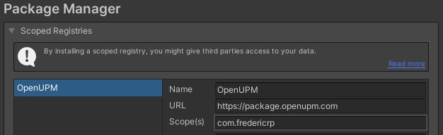
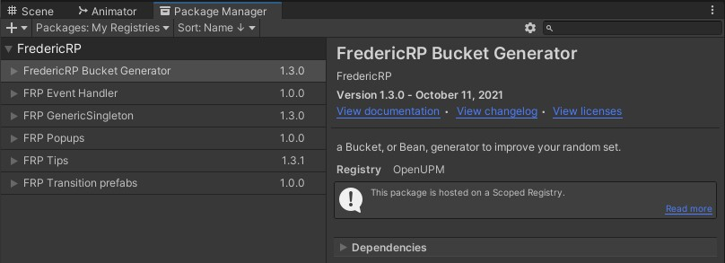

# Four Scenes Template

A unity project template that can serve every purpose you can think of.
This template was inspired by unity games projects we developed that were published on PC, Android, iOS, and Switch platforms.

## Why use it

I've made a [Medium post](https://medium.com/@FredericRP/four-scenes-template-ffe38a7043f5) on why I've created this package in my former video games studio.

## How to use it

### Installation

Follow those small 5 steps to test this asset inside Unity. It does not override any project settings so you can import in a brand new project or an existing one.

1. You MUST include **FredericRP's Standard Asset** package to this project for it to compile. See "FredericRP Standard Assets" section below
2. Import this package from the [Releases section](https://github.com/FredericRP/FourScenesTemplate/releases) of the github page.
3. It's already done if you use the full project, but if not, do not forget to include the 4 scenes included in the correct order (from 1. to 4..) in your build settings

4. If required, change the Scene Name parameter of the "PlayButton" GameObject on the scene "4.menu" to be the first scene of your game.

5. Of course, include your game scene in the build settings OR include the provided "game" sample scene, located under the *FourScenesTemplate/Example/Scenes* folder.

*Remark*: if you update from a previous version, beware that the tips are no more loaded from the streaming assets folder, but from a Resources folder.

### Editor test

Once the installation has been done, follow these steps to check if everything is ok.

1. Load the scene "1.staticLoading" and unload every other scene.
2. Hit "Play"

You should see the 4 scenes be loaded one after another, with a progress bar on 2nd and 3rd scene, and access the menu scene.
Clicking on the Play button launches your game.

> *This is very fast if you're on a fast PC with the default content, don't be surprised if you don't see each scene be loaded, even if I've added a 1.5sec wait before loading new scenes for the editor!*

These scenes will allow you to make the player wait for your content to be loaded.

## F.A.Q.

**Q**: I've got the error "**Scene 'game' could not be loaded because it has not been added to the build settings or the AssetBundle has not been loaded**".

**A**: please ensure you have followed all Installation steps. This package provides a template without a game: you have to create your own game, but for your convenience, we have included an almost empty "game" scene, located under the *FourScenesTemplate/Example/Scenes* folder.

**Q**: I have an error saying the **namespace FredericRP.*something* is not known**.

**A**: please ensure you have imported all required *Standard Assets* in their latest version. If you update from a previous version of this project, remove the *Standard Assets* submodule or package and include the separated assets as only they are updated now (follow the steps just below).

---

## FredericRP Standard Assets

This project uses a lot of Assets that I share freely on [FredericRP GitHub page](https://github.fredericrp.com). You must include them for it to work.

### Import as submodules

You can choose to add the assets as a git sub module with the following command (the prefered method as you will always get the latest news and fixes that way)
> git submodule add git@github.com:FredericRP/*asset name*.git "Assets/Standard Assets/*asset name*"

For test purpose, I include all my shared assets in the project, even if it does not uses all of them, here is the full list:
- BucketGenerator
- EasyLoading
- EventManagement
- GameQuest
- GenericSingleton
- ObjectPool
- PersistendDataSystem
- PlayerCurrency
- PopupHandler
- ScreenTransitions
- SimpleLocalization
- StringDataList
- Tips

### Import as packages

If not already, all assets will be available through openUPM.com so you can add it as a scoped registry and add them directly from the package manager.

1. Add the scoped registry for the com.fredericrp scope

2. Add packages from the package manager

