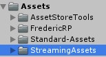

# Four Scenes Template

A unity project template that can served every purpose you can think of.
This template was inspired by unity games projects we developed that were published on PC, Android, iOS and Switch platforms.

## How to use it

### Installation
1. You MUST include **FredericRP's Standard Asset** package to this project for it to compile. See "FredericRP Standard Assets" section below
2. Import this package from the [Packages section](https://github.com/FredericRP/FourScenesTemplate/packages) of the github page.
3. Move the StreamingAssets folder in the Assets root. Do not replace content but if you already have one, merge them (move inner files and folder in the existing StreamingAssets).

 

4. Include the 4 scenes included in the correct order (from 1. to 4..) in your build settings

5. Change the Scene Name parameter of the "PlayButton" GameObject on the scene "4.menu" to be the first scene of your game.

6. Include this scene in the build settings OR include the provided "game" sample scene, located under the *FourScenesTemplate/Example/Scenes* folder.

### Editor test

Once the installation has been done, follow these steps to check if everything is ok.

1. Load the scene "1.staticLoading" and unload every other scene.
2. Hit "Play"

You should see the 4 scenes be loaded one after another, with a progress bar on 2nd and 3rd scene, and access the menu scene.
Clicking on the Play button launches your game.

> *This is very fast if you're on a fast PC with the default content, don't be surprised if you don't see each scene be loaded !*
These scenes will allow you to make the player wait for your content to be loaded.

## F.A.Q.

**Q**: I've got the error "**Scene 'game' could not be loaded because it has not been added to the build settings or the AssetBundle has not been loaded**".

**A**: please ensure you have followed all Installation steps. This package provides a template without a game: you have to create your own game, but for your convenience, we have included an almost empty "game" scene, located under the *FourScenesTemplate/Example/Scenes* folder.

---

## FredericRP Standard Assets

This project uses 6 of the Standard Assets freely available on [FredericRP GitHub page](https://github.fredericrp.com), so you must include it for the package to compile.

You can choose to :
- add the assets as a git sub module with the following command (the prefered method as you will always get the latest news and fixes that way)
> git submodule add git@github.com:FredericRP/Standard-Assets.git "Assets/Standard-Assets"

- OR use the unity package from the Asset Store also available here : [FredericRP Standard Assets on Unity Asset Store](https://assetstore.unity.com/packages/slug/156803)
- OR import the package available in the release section of the project (requires 1.3.0 version at least)

